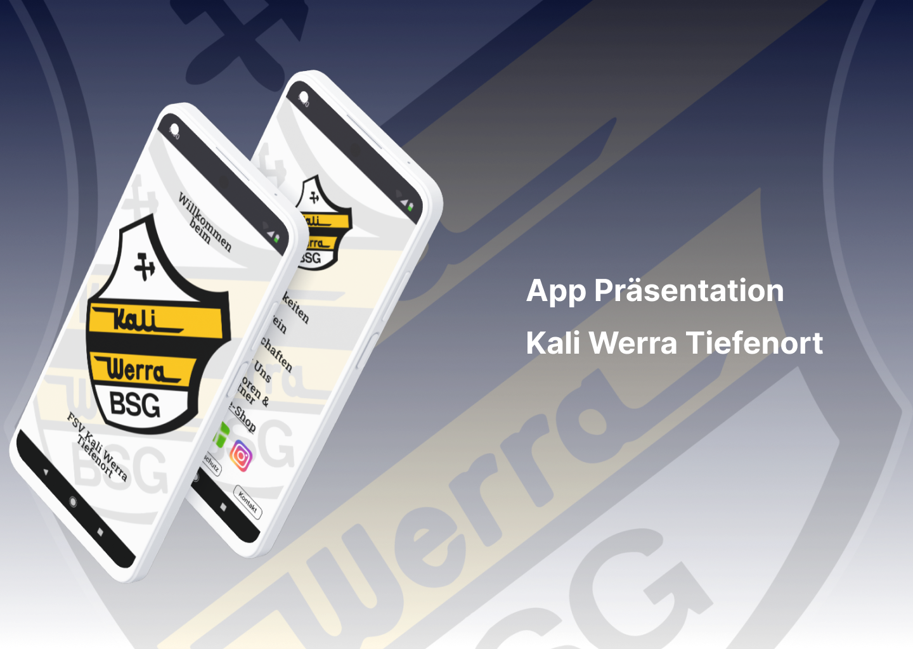

# Kali Werra Tiefenort

## App Präsentation

## Über Mich

## Kali Werra Tiefenort - Kernidee

## Kali Werra Tiefenort - Kernfeatures

## Kali Werra Tiefenort - Ausblick

## Verabschiedung

<a href="janmorgenweck@hotmail.com">E-Mail</a>
 
<a href="https://github.com/JanMorgenweck">Mein GitHub Profil</a>
 
<a href="https://github.com/JanMorgenweck/BSG-Kali-Werra-Tiefenort">Projekt Repository</a>
 
<a href="http://kali-werra.de"> Kali Werra Tiefenort</a>

## Special Thanks to:

Friends:

- Eike Matthias Engelmann
- Juri Huhn

Lecturer and tutors:

- Michael Karbe

- Brain Moyou
- Davide Stumm
- Laurenz Meies
- Max Krass